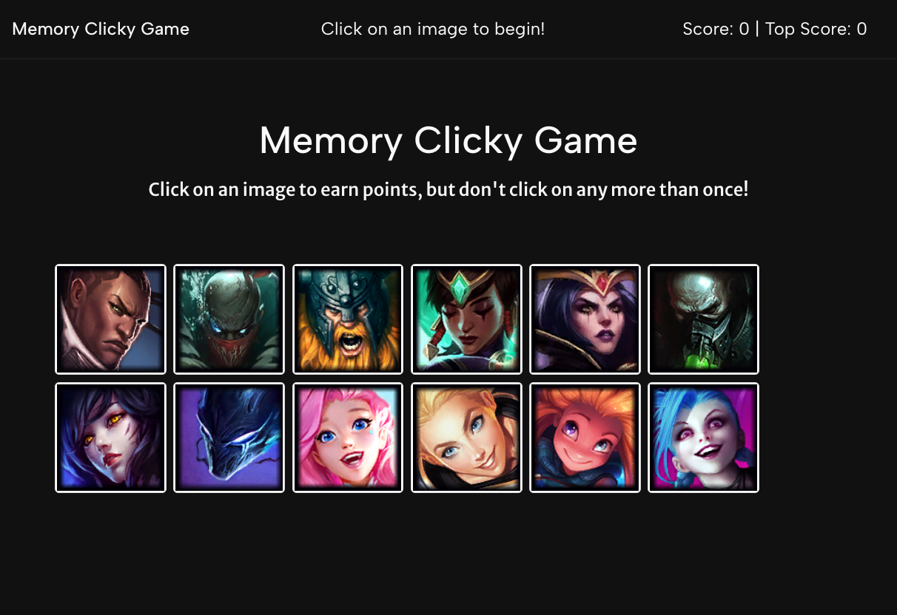

# memoryClickGame

## Overview

Clicky Game is a dynamic memory game built with React. Designed to test and enhance the player's memory, the game challenges users to click on different images without repeating any previous selection. Each correct guess increases the score, and the game resets upon a mistake, shuffling the images to present a new challenge. This project demonstrates the power of React's component-based architecture, state management, and event handling to create engaging, interactive web applications.

## Installation/Usage

No installation is requred, you can play the game via the deployed link here: [https://jennysiu.github.io/memoryClickGame/](https://memoryclickygame.netlify.app/)

Screenshot of deployed link: 

## Game Rules
1. The game displays a collection of images.
2. Click an image to earn points, but be careful not to click on any image more than once.
3. Each click shuffles the images presented.
4. If you click the same image twice, your score resets to zero, and the game restarts.

## Features
- React Components: Modular and reusable components to construct the UI.
- State Management: Efficiently manages the state of images and scores within the game.
- Event Handling: Responsive click events to interact with the game.
- Score Tracking: Real-time tracking of the user's current and best scores.
- Image Shuffle: Random shuffling of images upon each click to reset the game layout.
- React Hooks: Utilizes React Hooks for state and lifecycle features within functional components.

## License

MIT License

Copyright (c) [2024] [Jenny Siu]

Permission is hereby granted, free of charge, to any person obtaining a copy of this software and associated documentation files (the "Software"), to deal in the Software without restriction, including without limitation the rights to use, copy, modify, merge, publish, distribute, sublicense, and/or sell copies of the Software, and to permit persons to whom the Software is furnished to do so, subject to the following conditions:

The above copyright notice and this permission notice shall be included in all copies or substantial portions of the Software.

THE SOFTWARE IS PROVIDED "AS IS", WITHOUT WARRANTY OF ANY KIND, EXPRESS OR IMPLIED, INCLUDING BUT NOT LIMITED TO THE WARRANTIES OF MERCHANTABILITY, FITNESS FOR A PARTICULAR PURPOSE AND NONINFRINGEMENT. IN NO EVENT SHALL THE AUTHORS OR COPYRIGHT HOLDERS BE LIABLE FOR ANY CLAIM, DAMAGES OR OTHER LIABILITY, WHETHER IN AN ACTION OF CONTRACT, TORT OR OTHERWISE, ARISING FROM, OUT OF OR IN CONNECTION WITH THE SOFTWARE OR THE USE OR OTHER DEALINGS IN THE SOFTWARE.

## Acknowledgments
- [ngryman](https://github.com/ngryman): for providing champion names and icons [link to Repo here](https://github.com/ngryman/lol-champions/blob/master/champions.json)
- README template inspired by ChatGPT, an AI language model developed by OpenAI.
  (Note: portions of this README were generated with assistance from ChatGPT.)
- Special thanks to edX Boot Camps LLC for the project guidelines.

## Contact
Feel free to reach out to me if you have any questions or feedback.

Jenny Siu | 
[Email](jenny.siu79@gmail.com) |
[LinkedIn](https://www.linkedin.com/in/jenny-siu-534576156/)

